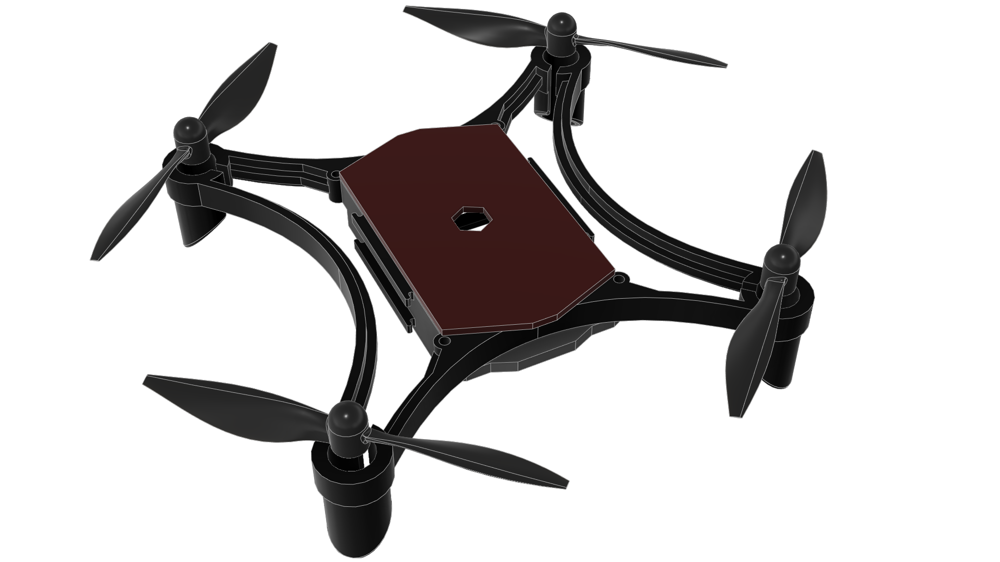

# QuadX
A small Drone designed to be simple and cheap and not require a physical controller. It can be controlled by any Smartphone or Computer through Wifi connection using a web browser. 

## Project Outline
- <B>Firmware:</B> Flight Controller and Sensors
- <B>Hardware:</B> Schematic, PCB and 3D Files
- <B>Webpage:</B> Controller Webpage Files


## [Frame](./Hardware/Frame/)

<p align="center">
    
</p>

3D printed drone frame designed to easily hold 8mm diameter coreless motors and the custom Flight Controller [Board](./Hardware/PCB/).


## [PCB](./Hardware/PCB/)

<p align="center">
    
    
</p>

### Features

- ESP32S3 Microncontroller
- Onboard BMI160 IMU
- Onboard AO3416 MOSFETS
- Onboard Camera Connector
- Onboard 1S Battery Charger

External GPS + Compass module can be connected using the JST-SH (1.00 mm) connector.

## [Firmware](./Firmware/)

The Firmware has been developed using PlatformIO. This Firmware shares a lot of code with my [TwinBlade](https://github.com/FreeFa11/TwinBlade) project.

- **Build**: Open the [Firmware](./Firmware/) folder with PlatformIO installed and build:
  ```
  platformio run
  ```
  Build the filesystem that contains all the required files:
  ```
  platformio run --target buildfs
  ```

- **Flash**: Connect the target microcontroller to flash and run:
  ```
  platformio run --target uploadfs
  ```
  After flashing the filesystem, flash the firmware with:
  ```
  platformi run --target upload
  ```

- **Connect**: After the firmware has been successfully flashed, the microcontroller will act as a Wifi access point with the name `QuadX`. Connect your smartphone to it with password `letsrock`. Open your web browser and type the URL `quadx.local`. This will connect you to the webserver and load the webpage where you can control and modify the drone and its settings.

  *`quadx.local` only works in Wifi AP mode*

<br>

The Web Interface has mostly been completed in terms of functionality. Still needs some work in terms of UI. 
<p align="center">
    
    
    
</p>

PID gains and controller sensitivity can be easily adjusted from the web interface along with the Wifi settings.

## TODO
- Improve Firmware and Controller
- Real Time Camera Support
- Position and Altitude Hold
- DIY Optical Flow from Camera


## License

All the files in [Hardware](./Hardware/) folder are licensed under [CERN OHL-P v2](./Hardware/LICENSE).

All other files are licensed under [BSD 3-Clause](./LICENSE).